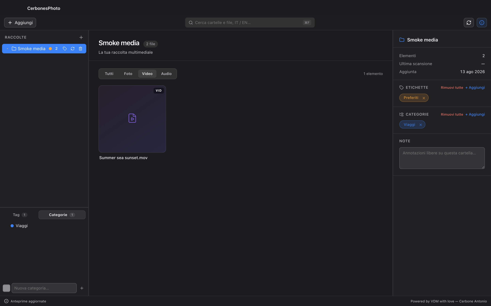
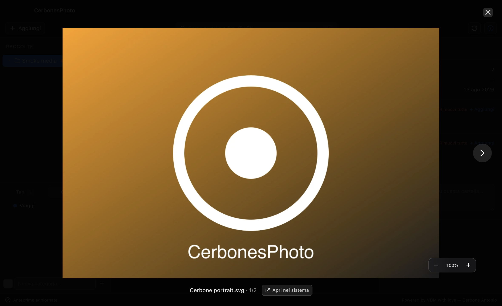
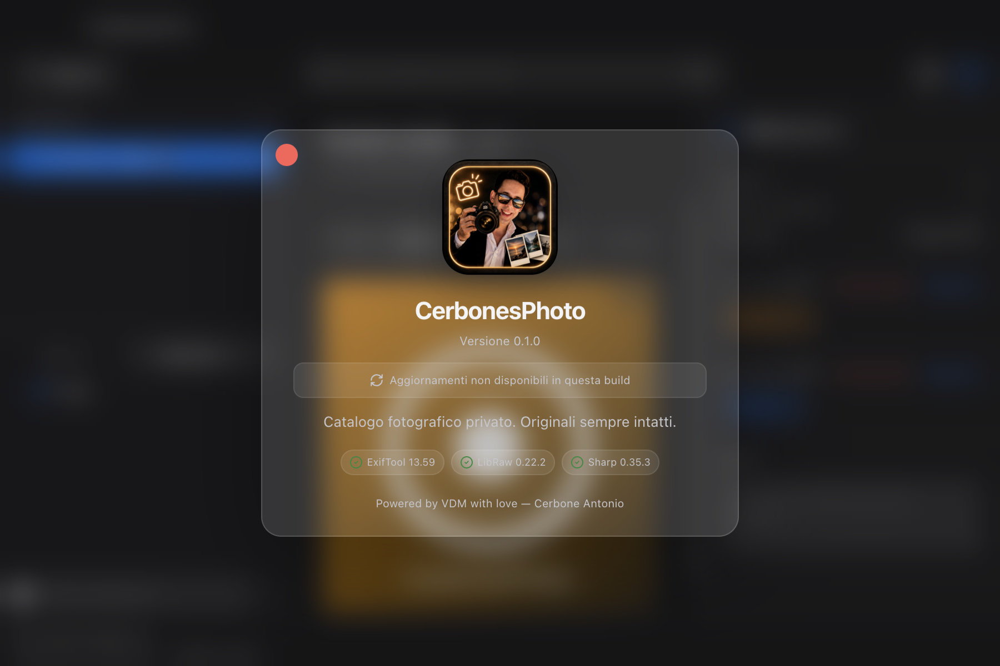

# CerbonesPhoto

Organizzatore di cartelle multimediale per macOS (Electron + React + TypeScript).

[Scarica l'ultima versione](https://github.com/dimaurovincenzo/CerbonesPhoto/releases/latest)

## Anteprima



| Visualizzatore integrato | Informazioni e motori fotografici |
| --- | --- |
|  |  |

## Sviluppo

```bash
npm install
npm run dev
```

## Build

```bash
npm run build        # compila main/preload/renderer
npm run build:mac    # produce un .dmg in /release (electron-builder)
npm run verify:photo-engines # verifica binari, versioni, hash e licenze
npm test             # test unitari ricerca/formati/store
npm run smoke        # avvio Electron e verifica automatica del renderer
```

## Aggiornamenti

Le build macOS pacchettizzate controllano il canale stabile delle GitHub Releases
di `dimaurovincenzo/CerbonesPhoto`. Il controllo parte dopo l'avvio e ogni sei ore;
la nuova versione viene scaricata in background, ma installazione e riavvio
richiedono sempre una conferma esplicita.

Gli errori di rete non bloccano catalogo, originali o workflow fotografico. Le
build di sviluppo e gli smoke test non contattano il provider degli aggiornamenti.

## Creare una release

Il comando seguente funziona soltanto su macOS arm64, branch `main`, worktree
pulita, versione SemVer coerente e remote GitHub atteso:

```bash
npm run release:github
```

Il comando esegue test, typecheck, build, verifica motori, firma, packaging DMG e
ZIP, checksum e crea una GitHub Release in **bozza**. La bozza deve essere
scaricata e verificata prima della promozione manuale: l'updater ignora bozze e
prerelease.

### Firma provvisoria

Le prime build usano il certificato locale `Apple Development` e non sono
notarizzate. Al primo avvio Gatekeeper può quindi richiedere un'autorizzazione
manuale. Questa limitazione deve rimanere visibile nelle note della release fino
alla migrazione a `Developer ID Application` e notarizzazione Apple.

## Architettura

- **Main process** (`src/main`): finestra, DB SQLite, scanner filesystem, thumbnail, protocollo media, IPC
- **Preload** (`src/preload`): API sicura esposta al renderer via `contextBridge`
- **Renderer** (`src/renderer`): UI React

Le cartelle sono gestite come **riferimenti** al filesystem (nessuna copia).
Le etichette sono ibride: **categorie gerarchiche** + **tag piatti colorati**.

## Ricerca bilingue

La ricerca globale lavora offline sui nomi già indicizzati di cartelle e file.
Il dizionario fotografico e personale italiano/inglese comprende sinonimi,
plurali e concetti composti: per esempio `mare` trova `sea`, mentre `barca`
trova anche `123_boat_23fs.mp3`. Nessun nome o percorso lascia il Mac.

## Workflow fotografico

CerbonesPhoto indicizza i file originali senza modificarli. Metadati, categorie,
tag e stato delle anteprime restano nel catalogo SQLite; miniature e preview
sRGB sono derivati eliminabili nella cache dell'app.

- standard: JPEG/JPG/JPE, PNG, TIFF/TIF, HEIF/HEIC, WebP, BMP, AVIF, GIF e SVG;
- RAW: CR2, CR3, CRW, NEF, NRW, ARW, SR2, SRF, RAF, ORF, ORI, RW2, RWL,
  DNG, PEF, PTX, 3FR, FFF, IIQ, MEF, MRW, X3F, ERF, DCR, KDC e SRW;
- metadati EXIF/IPTC/XMP letti tramite ExifTool persistente;
- preview RAW tramite LibRaw 0.22.2 arm64, con estrazione embedded e fallback render;
- orientamento automatico, conversione sRGB, zoom progressivo fino a 8×.

La compatibilità reale di un RAW dipende anche dal modello di fotocamera e dalla
variante del file: un'estensione riconosciuta non viene dichiarata certificata
senza un campione autorizzato passato nella matrice di test.

### Matrice RAW verificata

I campioni non vengono committati. `npm run fixtures:raw` scarica esclusivamente
file CC0 da [raw.pixls.us](https://raw.pixls.us/), verifica ogni SHA-256 e genera
il manifest riproducibile. `tests/raw-matrix.test.ts` controlla metadati,
thumbnail, preview sRGB e hash invariato dell'originale.

| Formato | Campione verificato | Esito |
| --- | --- | --- |
| CR2 | Canon EOS 40D sRAW2 | ready |
| CR3 | Canon EOS R6 | ready |
| NEF | Nikon COOLSCAN IV ED | ready |
| ARW | Sony ILCE-7S | ready |
| RAF | Fujifilm FinePix S5000 | ready |
| ORF | Olympus E-10 | ready |
| RW2 | Panasonic DMC-LX7 | ready |
| DNG | Blackmagic Micro Cinema Camera | ready |
| PEF | Pentax K10D | ready |

La matrice standard genera e verifica JPEG, PNG, TIFF, HEIC, HEIF, WebP, BMP e
AVIF. HEIC/HEIF e altri contenitori ImageIO non decodificabili da libvips usano
il fallback macOS `sips`, senza scrivere accanto all'originale.

## Altri formati multimediali

- audio: MP3, M4A, AAC, WAV, FLAC, OGG/OGA, Opus, AIFF;
- video: MP4, M4V, MOV, WebM, OGV, MKV, AVI, MPEG/MPG, TS/M2TS.

Il contenitore viene sempre indicizzato. La riproduzione dipende dai codec
disponibili in Electron/Chromium; se un codec non è decodificabile, CerbonesPhoto
apre il file nell'app predefinita di macOS.
